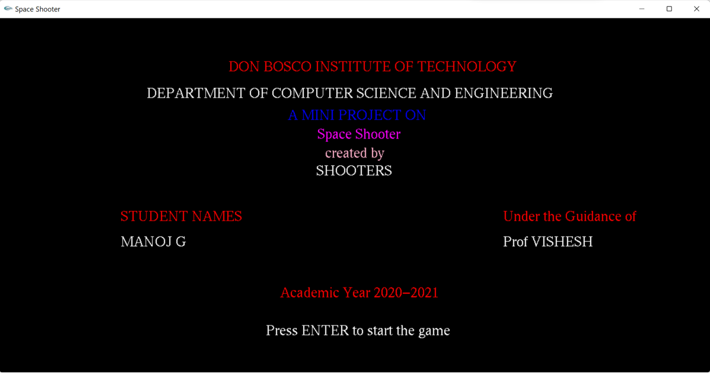
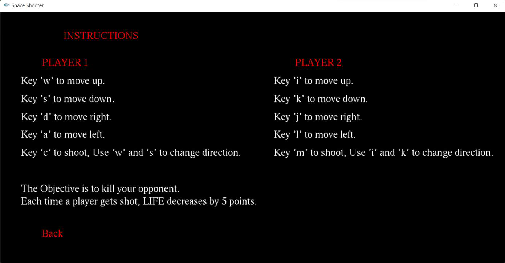
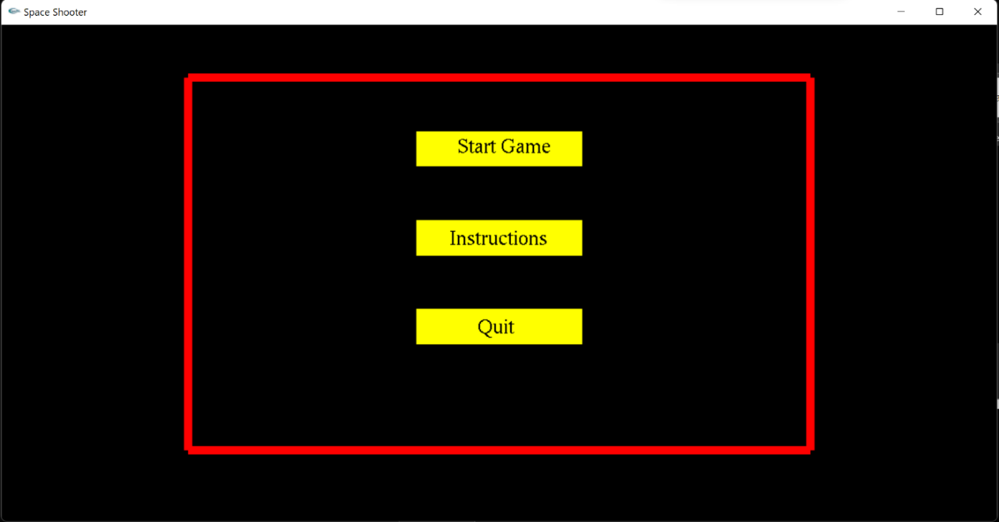
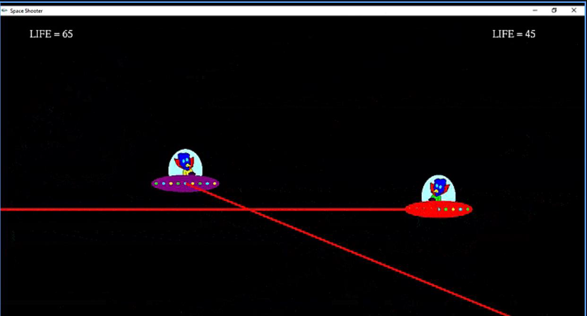
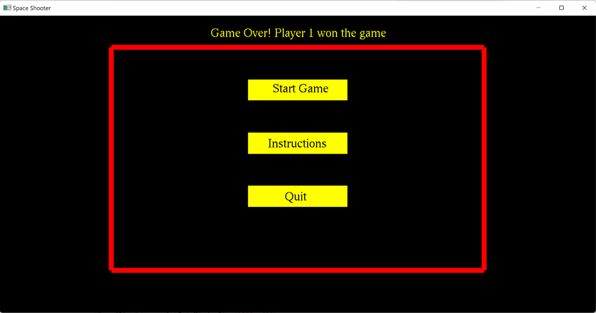

<h1 align="center"> 
    <a href="https://github.com/imanojg/Space-Shooter-Using-OpenGL">Space Shooter</a>  
    
</h1>
<a href="https://raw.githubusercontent.com/imanojg/Space-Shooter-Using-OpenGL/main/main.cpp">
  Code
  
  
 </a>

OpenGL project on the Space Shooter

## **Installation**

1) Install [CodeBlocks](https://www.codeblocks.org/downloads/binaries/) 
2) Insall [OpenGL](https://www.transmissionzero.co.uk/software/freeglut-devel/) 

## **Game Description**

*Keybord control for PLAYER 1* : 
> W - UP  
> S - DOWN  
> A - LEFT  
> D - RIGHT  
> C - to shoot, Use 'w' and 's' to change direction.    

*Keybord control for PLAYER 2* : 
> I - UP  
> K - DOWN  
> J - LEFT  
> L - RIGHT  
> M - to shoot, Use 'I' and 'K' to change direction.    
                                                                              
## **Objective**
                      
> kill your opponent.  
> Each time a player gets shot, LIFE decreases by 5 points.  

  
  

The above snapshot shows the Welcome Page of the project which contains the details about the project and Where the User can press the “ENTER” to get the Game Menu

The above Snapshot shows the Instruction Page where the player can learn how to play the Space shooter Game”

    

The above snapshot shows the Menu page where the User can select between Start Game ,Instruction and Quit”

 

The above snapshot shows the gameplay where we can see two players shooting each other and their lives at the top”

The Snapshot shows the Player winning Page after a player wins the match”
# Space-Shooter-Using-OpenGL
# Space-Shooter-Using-OpenGL
# Space-Shooter-Using-OpenGL
# Space-Shooter-Using-OpenGL
